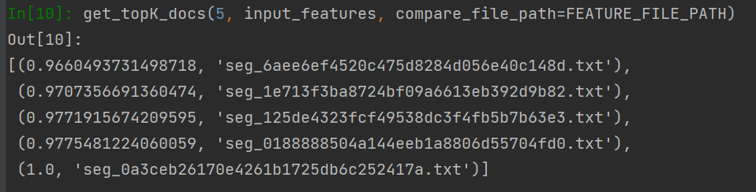

### JudgementProject2.0

现阶段主要目标
1. 审判书的校验（识别不存在自然段，和非判决书自然段）
2. 审判书的实证

上一阶段结果
[JudgementProject1.0](https://github.com/fuhaifei/JudgmentProject)

#### 目前已实现内容

1. 判决书校验

   在上一阶段的分类结果基础上，前端页面展示缺失的段落类型和非判决书段落

   

2. 判决书实证

   * 提取判决书的段落特征[cls向量]，取平均值后作为判决书特征
   * 使用余弦相似度衡量判决书的相似度，输入一篇判决书，系统返回相似度最高的几篇判决书

   

